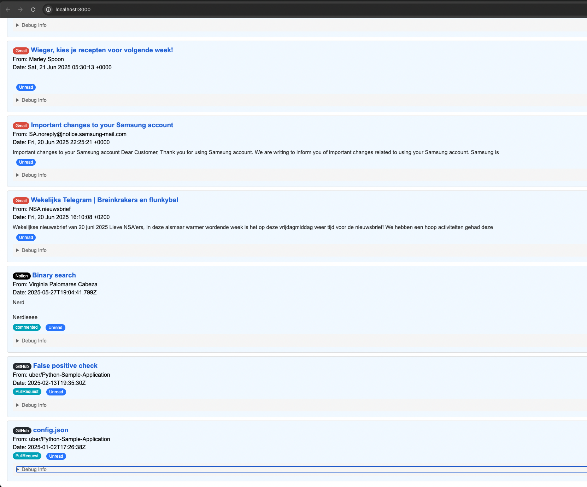

# Notification Aggregator

A simple notification aggregator that integrates with Gmail, GitHub, Notion and Slack. This application fetches your notifications and displays them on a local website.



## Setup

### Configuration

The application uses a single `config.json` file for all configuration. Each integration can be enabled or disabled independently:

```json
{
    "integrations": {
        "gmail": {
            "enabled": false,
            ...
        },
        "github": {
            "enabled": false,
            ...
        },
        "mock": {
            "enabled": true
        }
    }
}
```

### Gmail Setup (Optional)
If you want to enable Gmail integration:

1. Set `integrations.gmail.enabled` to `true` in `config.json`
2. Go to the [Google Cloud Console](https://console.cloud.google.com/)
3. Create a new project
4. Enable the Gmail API for your project
5. Create OAuth 2.0 credentials (Desktop Application)
6. Copy the credentials into the `credentials` section of the Gmail config

### GitHub Setup (Optional)
If you want to enable GitHub integration:

1. Set `integrations.github.enabled` to `true` in `config.json`
2. Go to [GitHub Settings > Developer Settings > Personal Access Tokens](https://github.com/settings/tokens)
3. Generate a new token with the `notifications` scope
4. Copy the token into the `token` field in the GitHub config

### Mock Integration
The mock integration is enabled by default and requires no configuration. It generates random test notifications to help you test the application.

## Installation

```bash
npm install
```

## Running the Application

```bash
npm start
```

Visit `http://localhost:3000` in your browser to see your notifications.

## First Run with Gmail

If you've enabled Gmail integration, on first run:
1. The app will provide a URL in the console for Gmail authentication
2. Visit that URL in your browser
3. Authenticate with your Google account
4. Copy the provided token
5. Paste the token information into the `token` section of the Gmail config

After setup, the application will show:
- Mock notifications (if enabled)
- Your Gmail messages (if enabled)
- Your GitHub notifications (if enabled)
- All notifications will be sorted by date
- Unread items are highlighted
- Each notification links to the original source 